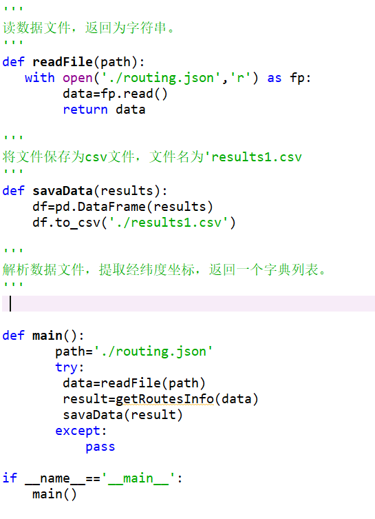
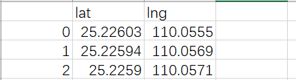
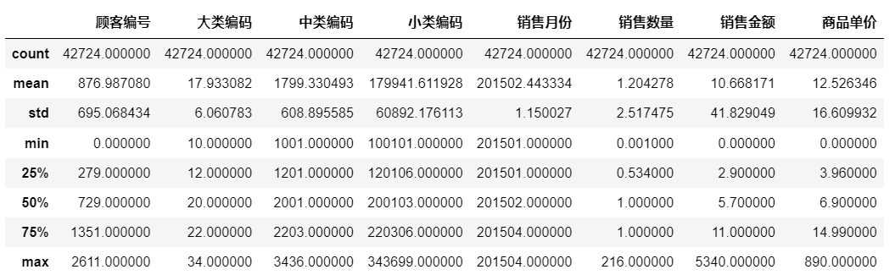
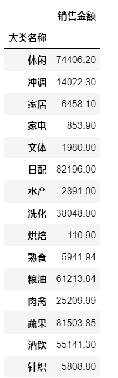
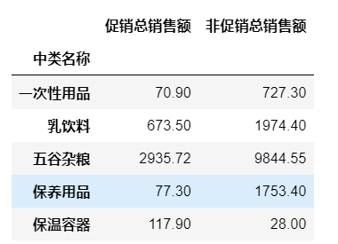
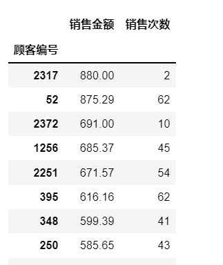

# PythonDataAnalysis
## 1.HTML解析

完成程序csv.py,实现从csv.html中把这个网页上的2020年以后的漏洞编号和漏洞描述爬下并保存至csv文件的name和description中.

注意：结果为一个csv文件，格式参考如下，必须含有name和description.

## 2.json解析

完成程序routing.py，实现从routing.json中解析处各个点的经纬度坐标，经度用lng表示，纬度用lat表示.

注意：只需要从光标所在位置填写，不要修改其他部分代码. 结果为一个csv文件，格式参考如下，必须含有lat和lng.

## 3.数据加工

### Task1 数据预处理

1. 缺失值处理：观察并删除缺失值
2. 一致化处理：将销售日期设置为datetime格式
3. 异常值处理

	(1) 删除日期异常的值

	(2) 数据异常：删除销售数量和销售金额为负的数值
4. 返回describe( )的信息（如下图）：该信息存放文件为results3.csv

注意：由于源数据有了修改，所以此处还应返回源数据。即返回值为描述信息和源数据

### Task2 根据大类名称，统计每个大类商品的销售总额，结果如下图：存放文件为results4.csv

### Task3统计每个中类商品的促销销售金额和非促销总销售额，如果该商品只有促销或只有非促销订单，则不做统计。部分结果如图：存放文件为results5.csv

+ 参考步骤：
1. 提取出中类名称、是否促销、销售金额属性
2. 选择促销值为是的数据和促销值为否的数据分别按中类名称统计销售金额
3. 将第2步得到的结果合并，修改列名称如图示

### Task4 统计4月总计消费金额前20的顾客，并显示其销售金额和消费次数，部分结果如图：存放文件为results6.csv

提示：可用数据透视表